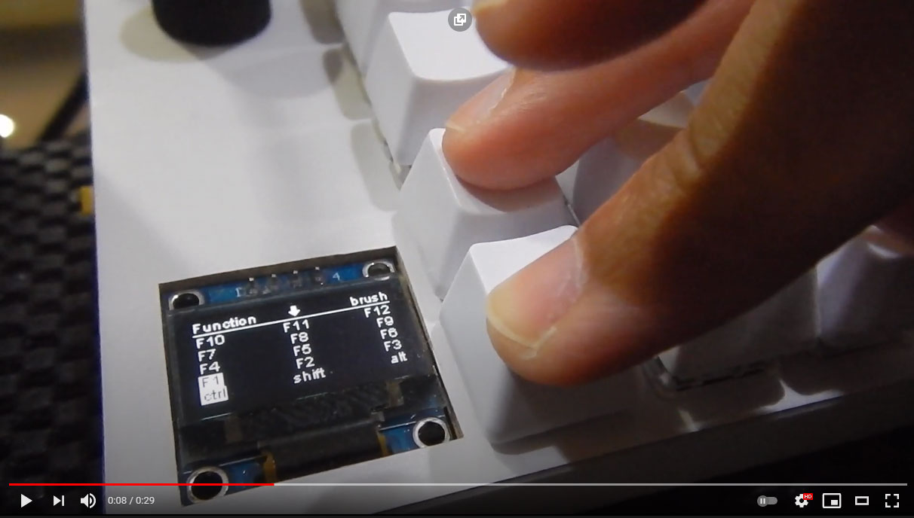
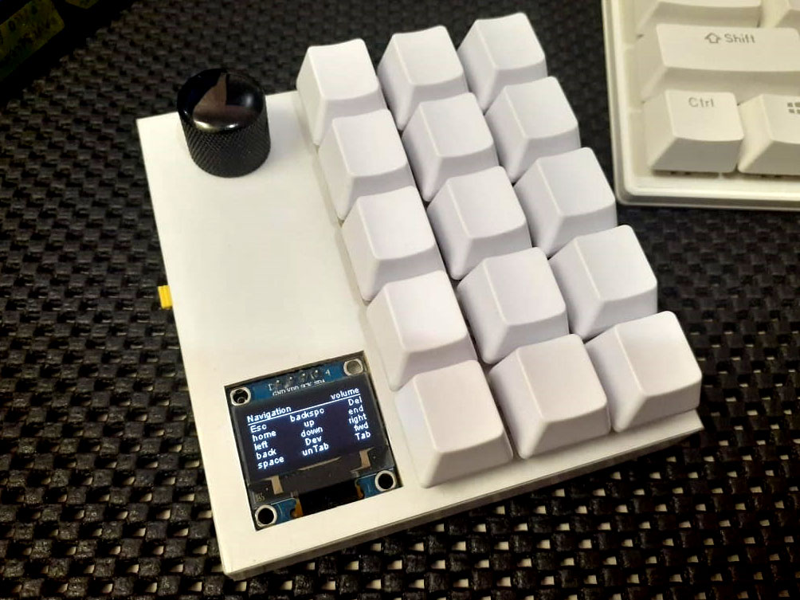
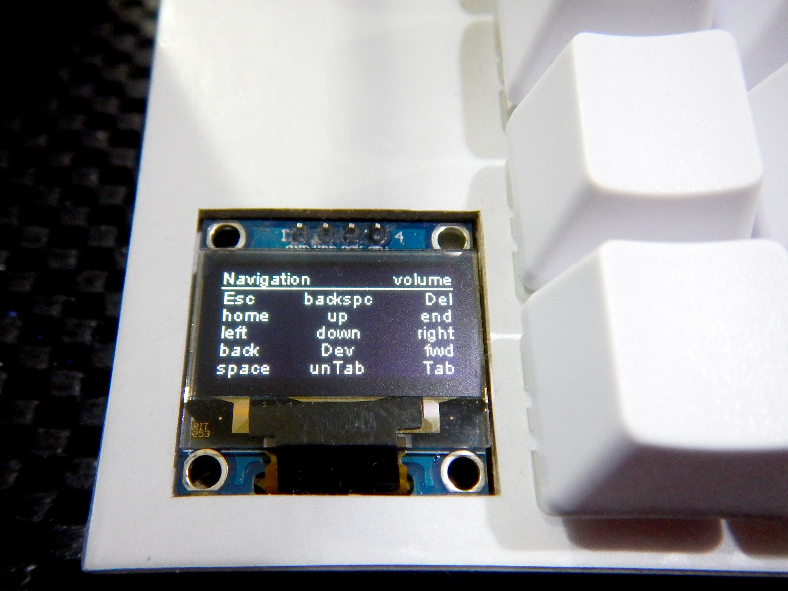
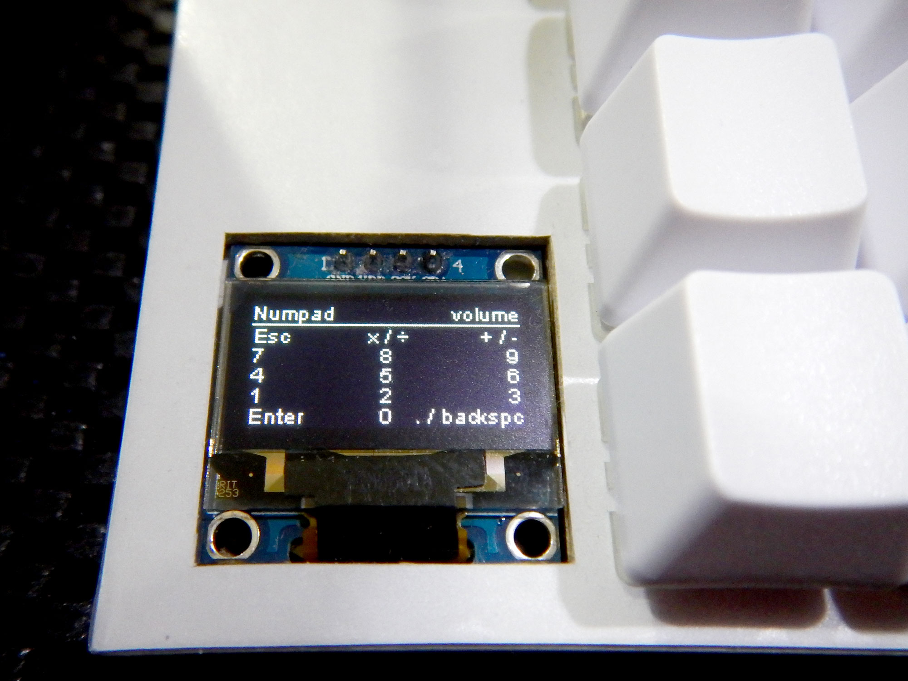
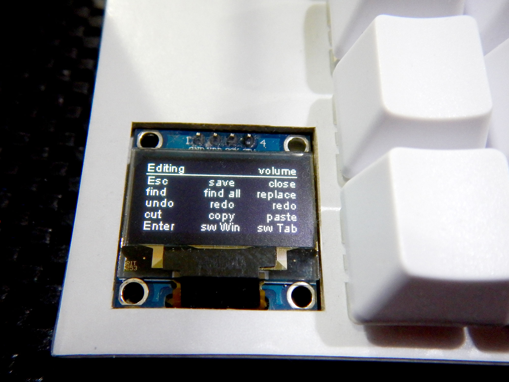
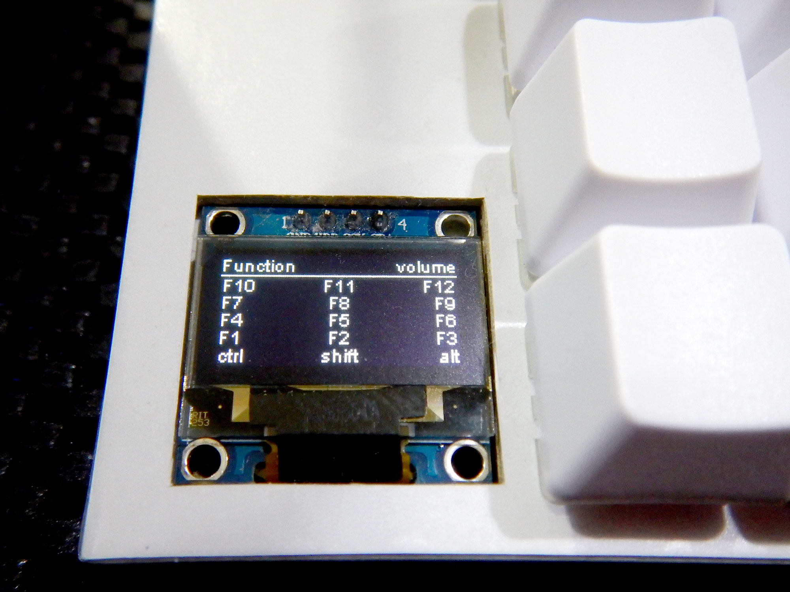

# ahoKeeb32

Macropad custom ini dibuat setelah pertama kali menggunakan keyboard mechanical ukuran 65% (68 keys). Karena pada layout ini ada beberapa tombol yang memang dihilangkan. Maka dari itu muncul gagasan untuk membuat sendiri macropad berikut.

Kenapa menggunakan LOLIN32 Lite, karena peruntukan macropad ini memang bukan untuk gaming dan lebih mengutamkan kepraktisan, maka sedikit delay dari koneksi BLE masih sangat tidak terasa.

## Hardware
* WEMOS LOLIN32 Lite
* 128x64 SSD1306 oled display
* Rotary encoder HW-040

## Software

- Arduino IDE
- Visual Studio Code

## My Build

- Switch:
  - Gateron milky brown switch 5 pin
  - Brown switch 3 pin (ex Royal Kludge)
- Keycaps CLV Blank PBT
- Custom PCB with hotswap socket
- Matrix PCB
- Sandwish case dari bahan karton samson kraft
  - Lapis kertas sticker putih polos
  - Cold laminated, matte finish

## Images

## Library

Thanks for the great library:

- <a href="https://github.com/ThingPulse/esp8266-oled-ssd1306">ThingPulse OLED SSD1306 (ESP8266/ESP32/Mbed-OS)</a>
- <a href="https://github.com/T-vK/ESP32-BLE-Keyboard">ESP32 BLE Keyboard library</a>